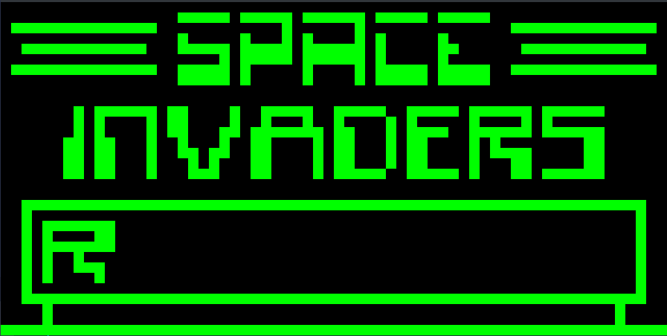
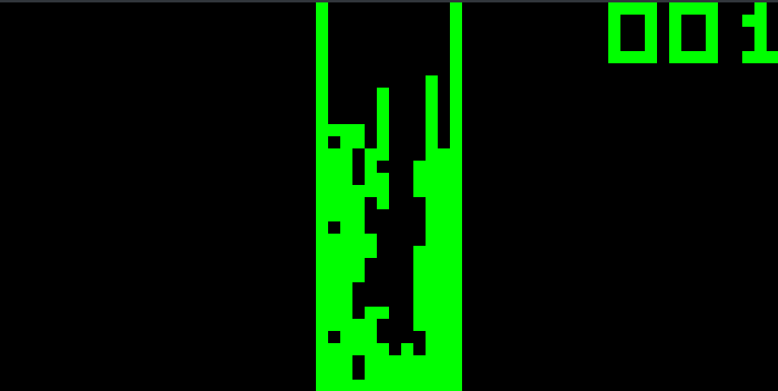

# Rust-Chip8-Emulator
chip8 emulator written in rust

It's a Chip8 Emulator written in rust. I wrote it because reddit recommended it as a good beginner project.
So I did. Main reason why it is considered a beginner friendly project is, because there are a lot of resources
for that project and because chip8 only has 35 opcodes you have to implement which is small compared with other 
systems you could write an emulator for.

ROMS can be played by writiing ```cargo run roms/TETRIS``` in the terminal

Most of the ROMS except for "Tetris [Fran Dachille, 1991].ch8" were made by David Winter

I got the ROMS from this website [here](https://www.zophar.net/pdroms/chip8/chip-8-games-pack.html)

And I also would like to give a big thanks to aquova, who made pdf file regarding chip8 emulation.
The pdf can be found [here](https://github.com/aquova/chip8-book)


